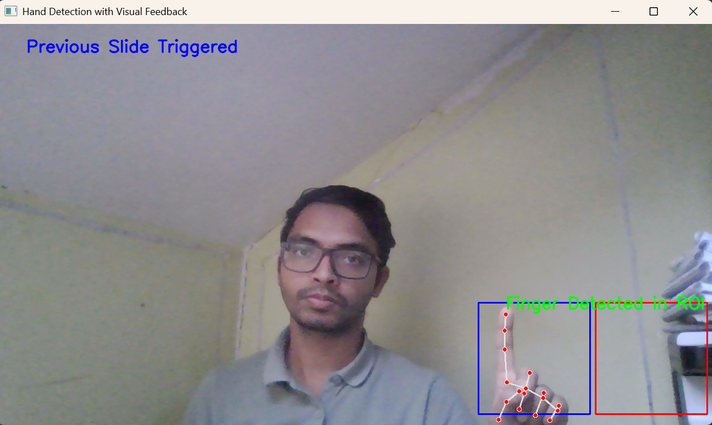

# gesture_control_PPTslides

Run the ppt file first in full screen / slide show; you can use F5 from keyword to do so.
then execute the python code.

I'm using a conda environment with python version 3.9.20
'conda create -n pptvenv python=3.9' to create an env

